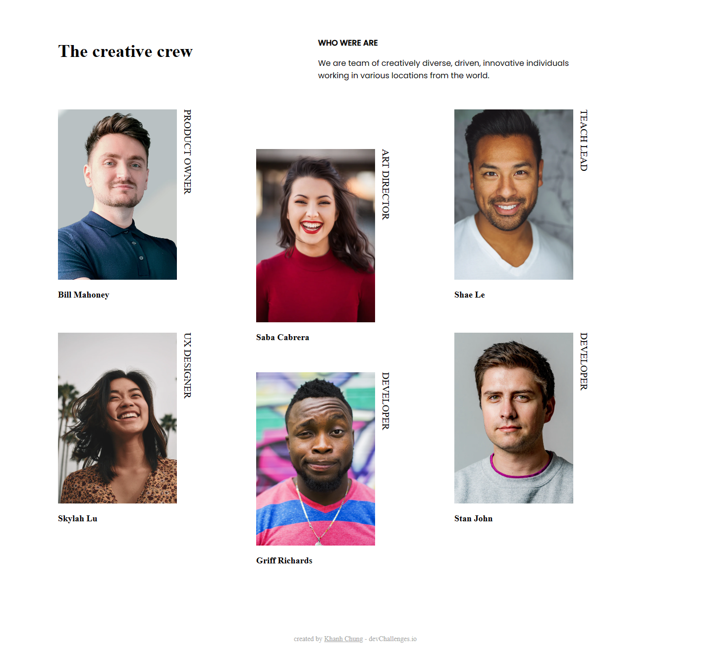
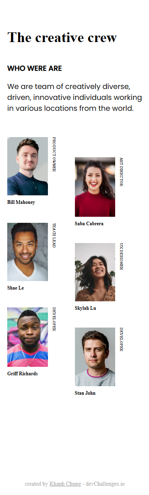

<!-- Please update value in the {}  -->

<h1 align="center">My Team Page</h1>

   Solution for a challenge from  <a href="http://devchallenges.io" target="_blank">Devchallenges.io</a>.

  <h3>
    <a href="https://my-team-page-96c59.web.app">
      Demo
    </a>
     | 
    <a href="https://github.com/craftzmask/my-team-page">
      Solution
    </a>
     | 
    <a href="https://devchallenges.io/challenges/hhmesazsqgKXrTkYkt0U">
      Challenge
    </a>
  </h3>

<!-- TABLE OF CONTENTS -->

## Table of Contents

- [Overview](#overview)
  - [Built With](#built-with)
- [Features](#features)
- [Contact](#contact)
- [Acknowledgements](#acknowledgements)

<!-- OVERVIEW -->

## Overview

#### Main Page

#### Mobile Page

Introduce your projects by taking a screenshot or a gif. Try to tell visitors a story about your project by answering:

- Where can I see your demo?
  - You can see it [here](https://my-team-page-96c59.web.app).
- What was your experience?
  - This was pretty tough, especially for writing text vertically and keeping the second column lower others for large and small screen.
- What have you learned/improved?
  - I just learned how to write text vertically and practiced using Grid.
- Your wisdom? :)
  - Grid is easy!!!

### Built With

<!-- This section should list any major frameworks that you built your project using. Here are a few examples.-->

- HTML
- CSS

## Features

<!-- List the features of your application or follow the template. Don't share the figma file here :) -->

This application/site was created as a submission to a [DevChallenges](https://devchallenges.io/challenges) challenge. The [challenge](https://devchallenges.io/challenges/hhmesazsqgKXrTkYkt0U) was to build an application to complete the given user stories.

- <strong>User story</strong>: I can see a page following [the given design](https://www.figma.com/file/F8d1qJsorEdY47N74HLxQ4/team-page-challenge?type=design&mode=design)

## Acknowledgements

<!-- This section should list any articles or add-ons/plugins that helps you to complete the project. This is optional but it will help you in the future. For exmpale -->

- [CSS-Tricks](https://css-tricks.com/snippets/css/complete-guide-grid/)
- [CSS Grid Layout](https://developer.mozilla.org/en-US/docs/Web/CSS/CSS_grid_layout)

## Contact

- GitHub [craftzmask](https://github.com/craftzmask)